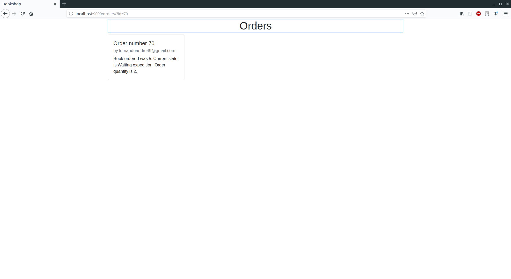
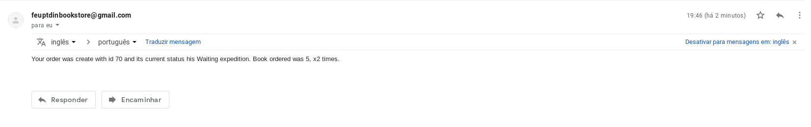

# An enterprise distributed system - Bookstore

## Overall architecture

The solution is composed of two main modules: The **Bookstore** and the **Warehouse**. Both of these applications run on a ***Tomcat Apache*** server, have ***REST*** web services implemented within,
and use the ***JDBC*** to access a ***MySQL*** database.
1. The **Bookstore**, makes use of the ***JAX-RS API*** to implement 2 web services, one for book listing and other of order listing and creation. It sends a message to the warehouse when some book is out of stock.
2. The **Warehouse**, just like the **Bookstore**  makes use of the ***JAX-RS API*** to implement 1 web service for order related actions. It uses the ***Java Message Queue API*** together with the ***ActiveMQ Messaging Service*** to consume messages asynchronously.

## Included functionalities

* Book listing on the **Bookstore**;
* Show specific book;
* Create order for specific book;
* Show order updated status on the **Bookstore** page;
* Show all orders on the **Bookstore** admin page;
* Mark an order as satisfied on the **Bookstore** admin page;
* Send an e-mail to the target client upon order creation.
* Send a message to the warehouse when a book's stock is insufficient;
* Consume the messages asynchronously on the **Warehouse** message queue;
* Allow order dispatchure on the **Warehouse** page;
* Update the order on the **Bookstore** when it is dispatched;
* Update the stock of the product when an order is satisfied;
* Send an e-mail when a previous waiting order is dispatched.

## Main flows of use

1. ### The **Bookstore**  
2. ### The book page 
3. ### The customer order page 
5. ### The Waiting expedition e-mail 
6. ### The **Warehouse** 
7. ### The admin order page 
8. ### When the dispatch occurs 
9. ### The dispatch occured e-mail 

## Build and run the application

### Install dependencies

You need to garantee you have these dependencies installed on your machine:

1. `maven` - A ***java*** software project maanger.
2. `java`
3. `mysql` - We used the `mariadb` package
4. `activemq` - A message queue service(included in the zip)

### Running instructions

1. `cd cd apache-activemq-5.15.9-bin/apache-activemq-5.15.9/bin/` and `sudo ./activemq console` to start the message queue service.
2. `sudo systemctl start mariadb` or any related `mysql` package to start the `mysql server`
3. `mysql -u username -p new_database < database.sql` will create the database schema.
4. `cd feup.bookshop` and `mvn tomcat7:run`
5. `cd feup.warehouse` and `mvn tomcat7:run`

## Developed by

1. Bruno Alexandre Oliveira Dias, up201504859
2. Fernando André Bezerra Moura Fernandes, up201505821
