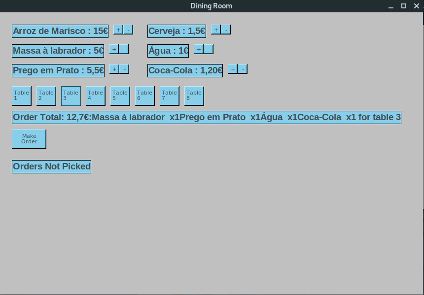
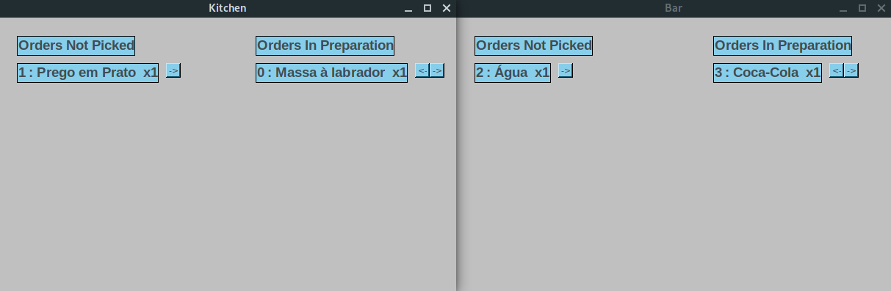
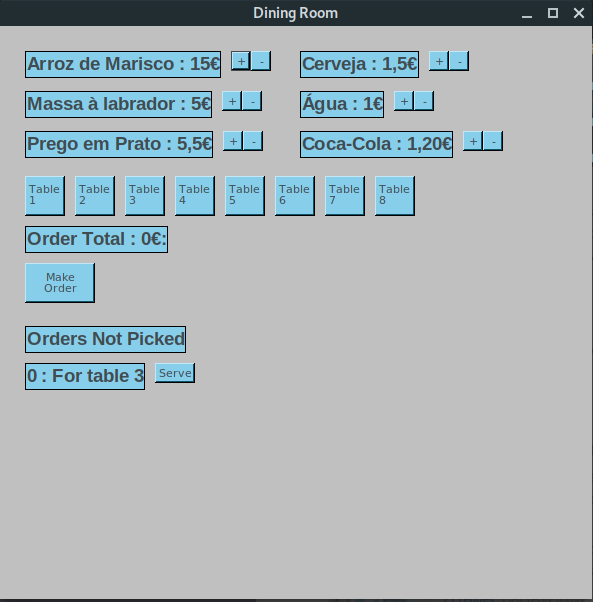
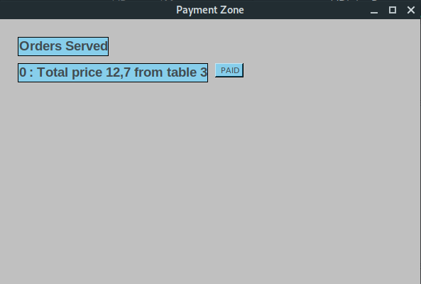

# Report - Restaurant Order and Account System

Subject : TDIN

## Project Members

1. Bruno Alexandre Oliveira Dias - up201504859
2. Fernando André Bezerra Moura Fernandes - up201505821

## Project Content

From here now we'll explain our project solution, including system architecture, functionalities and use sequences of the developed application.

### Architecture

- When the **Dining Room** wishes to create an order, it remotely creates it on the **Central Node**, which has an event associated with that creation. The **Bar** and **Kitchen** have that event subscribed and when it gets triggered they are remotely called to receive **Order Parts**.
- When either the **Bar** or the **Kitchen** have changed the status of an **Order Part**, they remotely call the **Central Node** to update it there and when all the **Order Parts** are ready, the **Central Node** triggers an event(for which the dining room terminals are subscribed) that notifies the **Dining Room** terminals.
- When an order is served it remotely calls a method on the **Central Node** that triggers an event, for which the **Payment Zone** is subscribed, so the order is received by the **Payment Zone**.
- Finnaly, when an order is signaled as payed on the **Payment Zone** terminal, it remotely calls a method on the **Central Node** which prints the order invoice and updates it to paid.

The orders are all stored in the **Central Node** inside a **Map**.
The **Bar** and **Kitchen** store the order's **order parts** inside a **Map**, and are consistent with those in the Central Node.
The Payment Zone stores the Paid orders inside a **Map** and is consistent with those in the Central Node.

### Functionalities

List of implemented functionalities:

1. Order creation with quantity selection on different types of dishes.
2. Table selection.
3. Order differentiation between Kitchen and Bar.
4. Notify the Kitchen and Bar for the created order.
5. Changing the order part status on each terminal.
6. Notify the dining room terminals when an order is ready.
7. Serve the order and notify the Payment Zone.
8. Change the order status to Paid on the Payment Zone and notify the Central Node to print the Invoice.

### Use sequences

1. So firstly here is the Dining Room terminal, where the waiter should select the number of desired dishes and drinks for a specific table, and then click Make Order.  

2. Then, depending on the order type, it will show up on the Kitchen and Bar terminals where the people there can change the order status between `Not Picked`, `In preparation` and `Ready`.  

3. Whenall the **order parts** tare ready it'll show up, on the `Orders Not Piked` zone of the dining room. terminal. A waiter can collect the order and serve it by clicking `Serve` 

4. When a order is served it'll show up on the Payment zone where it is ready to be paid. The person there can click `PAID` if the order has been paid and the Invoice will be printed on the Central Node. 